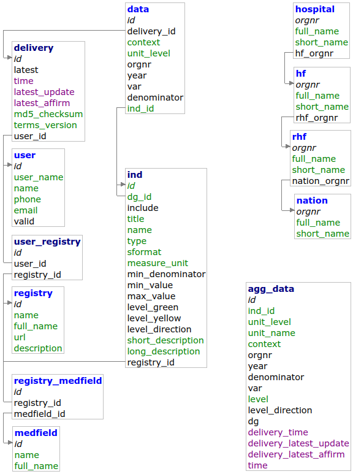

# Programvarearkitektur

## Databasediagram

### Beskrivelse av tabellene i databasen

Tabell        | Beskrivelse
---           | ---
ind           | Beskrivelse av indikator. 
User          | Brukere som kan levere data til løsningen. «valid» må settes til 1 (default lik 0) av en bruker med administratorrettigheter for at brukeren skal kunne legge inn data. 
user_registry | Mapping mellom bruker og register, som forteller hvilke registre bruker kan levere data fra.
registry      | Navn og kortnavn på de medisinske kvalitetsregistre.
delivery      | Hver levering får en unik leverings-ID 
data          | Innlevert data + kobling til levering og om orgnr er fra sykehus, HF, RHF eller nasjonalt. 
agg_data      | Aggregerte data 
hospital      | Alle behandlingsenheter på sykehusnivå, med organisasjonsnummer og kobling til tilhørende HF.
hf            | Alle helseforetak, med organisasjonsnummer og kobling til tilhørende RHF
rhf           | De fire regionale helseforetak, med organisasjonsnummer, og private behandlere
nation        | Norge

## Systemskisse

