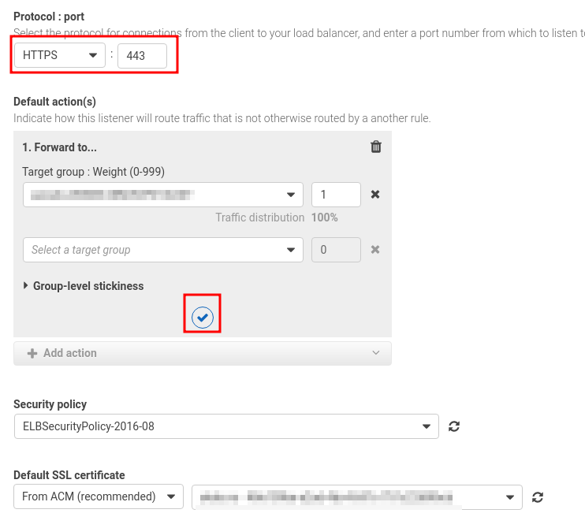

# AWS

## Få opp en app/nettside

For tiden ufullstendig, men her kommer forhåpentligvis en komplett steg-for-steg-oppskrift på hvordan setter opp en app ved bruk av Elastic Beanstalk og Docker.

### Dockerfile

Lag en `Dockerfile` med appen som eksponerer port 80, med linjen `EXPOSE 80`. Eksempler på en slik `Dockerfile` kan finnes i repositoriene til [tmongr](https://github.com/mong/tmongr/blob/master/Dockerfile) (en Shiny-app) og [mong-api](https://github.com/mong/mong-api/blob/master/Dockerfile) (node-app).

### Elastic Beanstalk og Dockerhub

Dette er en beskrivelse av hvordan vi kan få _Github Actions_ til å dytte _Docker_-bilde til _Dockerhub_ (eller lignende) og samtidig gi beskjed til _Elastic Beanstalk_ om å bruke nytt bilde. Under er et eksempel på en _Github Actions_-fil til dette formålet.

```yml
name: Publish Docker image
on:
  release:
    types: [published]
  push:
    branches: [main]
  pull_request:
    branches: [main]

jobs:
  push_to_registries:
    name: Push Docker image to docker hub
    runs-on: ubuntu-latest
    env: # Miljøvariabler for å kunne koble seg til AWS
      AWS_ACCESS_KEY_ID: ${{ secrets.AWS_ACCESS_KEY_ID }}
      AWS_SECRET_ACCESS_KEY: ${{ secrets.AWS_SECRET_ACCESS_KEY }}
      AWS_DEFAULT_REGION: 'eu-west-1'
    steps:
      - name: Check out the repo
        uses: actions/checkout@v2
      - name: Prepare # sette på tags
        id: docker_meta
        uses: docker/metadata-action@v3
        with:
          images: <org>/<name> # navnet på docker image
          tags: |
            type=ref,event=branch
            type=ref,event=pr
            type=semver,pattern={{version}}
            type=semver,pattern={{major}}.{{minor}}
      - name: Set up Docker Buildx
        uses: docker/setup-buildx-action@v1
      - name: Login to DockerHub
        if: github.event_name != 'pull_request'
        uses: docker/login-action@v1
        with:
          username: ${{ secrets.DOCKERHUB_USERNAME }}
          password: ${{ secrets.DOCKERHUB_TOKEN }}
      - name: Build and push to Docker Hub
        uses: docker/build-push-action@v2
        with:
          context: .
          file: ./Dockerfile
          push: ${{ github.event_name != 'pull_request' }}
          tags: ${{ steps.docker_meta.outputs.tags }}
          labels: ${{ steps.docker_meta.outputs.labels }}
      - name: Set release variables
        if: github.event_name == 'release'
        run: |
          echo "S3Key='<name_on_file1>.json'" >> $GITHUB_ENV
          echo "env_name=<prod_beanstalk_env_name>" >> $GITHUB_ENV
          echo "version_label=${GITHUB_REF:10:6}" >> $GITHUB_ENV
          echo "descr='Release tag deploy'" >> $GITHUB_ENV
      - name: Set QA variables
        if: github.event_name == 'push'
        run: |
          echo "S3Key='<name_on_file2>.json'" >> $GITHUB_ENV
          echo "env_name=<qa_beanstalk_env_name>" >> $GITHUB_ENV
          echo "version_label=${GITHUB_SHA:0:7}" >> $GITHUB_ENV
          echo "descr='Master commits deploy'" >> $GITHUB_ENV
      - name: Update elasticbeanstalk
        if: github.event_name != 'pull_request'
        run: |
          aws elasticbeanstalk create-application-version \
            --application-name tabellverk \
            --source-bundle S3Bucket="<S3_bucket_name>",S3Key=${{ env.S3Key }} \
            --version-label ${{ env.version_label }} \
            --description ${{ env.descr }}
          aws elasticbeanstalk update-environment \
            --environment-name ${{ env.env_name }} \
            --version-label ${{ env.version_label }}
```

- Dette eksemplet vil dytte opp til `<org>/<name>` alle commits til `main`-grenen og alle releaser. Alle Pull Request til `main`-grenen vil kun bygge Docker-fila (`docker/setup-buildx-action`).
- Miljøvariablene `DOCKERHUB_USERNAME` og `DOCKERHUB_TOKEN` må legges inn som hemmeligheter under _Settings/Secrets_ på Github for at Github Actions skal kunne koble seg til Dockerhub.
- Miljøvariablene `AWS_ACCESS_KEY_ID` og `AWS_SECRET_ACCESS_KEY` må legges inn som hemmeligheter under _Settings/Secrets_ på Github for at Github Actions skal kunne koble seg til AWS.
- `metadata-action` vil tagge med `main` for commits til `main`-grenen, og tagge med `latest` samt versjonsnummer (f.eks `v1.2.0`) for alle nye releaser (hver gang det lages en ny _release_ på _Github_).
- Navnet på de _Beanstalk_ som brukes settes inn i stedet for `<prod_beanstalk_env_name>` og `<qa_beanstalk_env_name>`.
- I _S3_-bøtta `<S3_bucket_name>` legges det en json-fil med navn `<name_on_file1>.json` med følgende innhold (bytt ut `latest` med `main` i fil `<name_on_file2>.json`):

```json
{
    "AWSEBDockerrunVersion": "1",
    "Image": {
      "Name": "<org>/<name>:latest"
    },
    "Ports": [
      {
        "ContainerPort": "80"
      }
    ]
  }
```

### SSL

- Gå inn på _Load Balancers_ under EC2.
- Finn den som hører til _EC2_-instansen som ble snurret opp av _Elastic Beanstalk_. Velg den som er dannet omtrent da din _Elastic Beanstalk_ ble dannet, gå på fanen _Listeners_, trykk på lenke og så på neste lenke (det må finnes en annen og enklere måte å finne riktig _Load Balancers_ ...).

- Legg til to _Security groups_ under _Description/Edit security groups_: WebDMZ (Allow webserver access from anywhere) og world (Facing outward).

- Legg til en ny _listener_ med `https` gjennom port 443 med en regel `forward to ...`




- Slett den opprinnelige reglen for den opprinnelige _Listener_ og lag en ny regel som _redirect_ til port 443.  


- Gå inn på _Route 53_ og _Create record_. Aktiver _Alias_ og velg _Alias to Application and Classic Load Balancer_. Legg gjerne inn både `A` og `AAAA` samtidig (_Add another record_).


## S3

### Tilgang deploy github actions

For å gi tilgang for github-bruker til å dytte opp endringer til ny bøtte må denne bøtta legges inn i *policy* `ci-mong-api`, som ligger på `IAM/Access management/Policies`.

