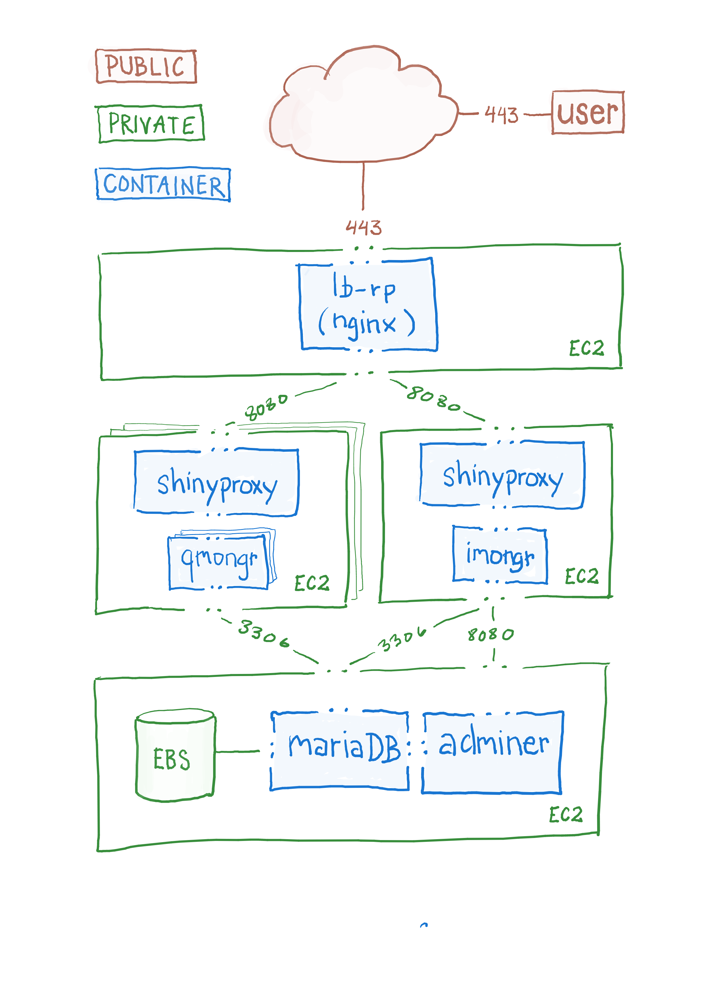
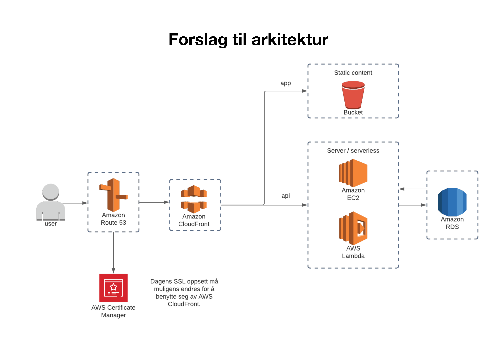

# Oppgaver utført av Jupiter

## Oppstart 3. november 2020

Første møte med Jupiter og SKDE fant sted 3. november 2020 ved Linken.

Jupiter ble orientert om status for prosjektet og i grove trekk hva vi ønsket videre. Det ble avtalt to workshop uken etterpå:
- en workshop med utviklere i Jupiter og SKDE
- en workshop med kommunikasjonssjef i SKDE og tjenestedesigner i Jupiter

Begge workshops finner sted i SKDE sine lokaler den 11. november 2020.

## Workshops 11. november 2020

Bli-kjent-workshop med utviklere i Jupiter og SKDE. I tillegg hadde kommunikasjonssjef i SKDE og tjenestedesigner i Jupiter egen workshop. Det ble bestemt at vi jobber i sprinter på to uker. Hver sprint starter med et møte der vi går gjennom hva som ble gjort i forrige sprint og definere oppgaver for nester sprint.

Sykehusviseren er per 11. november 2020 på Amazon Web Services (AWS) og kjører på flere EC2 instanser (se figur). 

### Oppgaver gitt til Jupiter

- Utvikle et forslag til ny stack.

## Første sprint 18. november 2020

Jupiter presenterte sitt forslag til ny stack (se figur). Det ble blant annet anbefalt å:

- Flytte databasen over til "managed" database (*AWS RDS* siden vi bruker AWS).

  Vi slipper da å drifte vedlikehold og sikkerhetskopiering. Gir også bedre skalering og stabil tilgjengelighet. Databasen anbefales også å flyttes til privat subnet for å bedre sikkerheten. De var ellers fornøyd med teknologien som er valgt (mariaDB).

- Erstatte `Shiny` med `node.js`. 

  `Shiny` bruker i dag mye tid på å starte opp og hente ut data fra databasen (omtrent 10 sekund). I tillegg inneholder `Shiny` mye `javascript` og `css` som sendes til klienten men ikke blir brukt.

- På sikt migrere kode fra `javascript` til `typescript`.

  Gjør kodingen enklere å skrive og vedlikeholde, og reduserer antall bugs som introduseres i koden.

- Hoste nettside statisk ved bruk av CDN. Dette vil gi betydelig bedre lastetider. S3 (AWS) ble foreslått til hosting. For CDN kan vi bruke Cloudfront (AWS), eventuelt Cloudflare, Vercel eller Netlify.

### Oppgaver gitt til Jupiter

Det ble gitt noen oppgaver tilhørende front-end-delen (se liste under). Det ble også bestemt at Jupiter konvertere kode fra `javascript` til `typescript` der man endrer i koden.

- Fjerne linjer helt når man filtrer på måloppnåelse
- Funksjon for å laste ned figurer
- Vise alle enheter i stolpediagram
- Sorter indikator i definert rekkefølge (ikke alfabetisk som i dag)
- Få opp advarsel hvis nettside åpnes i gammel nettleser (Internet Explorer)
- Utvide testing av koden
- Implementere automatisk formatering av kode, testing og typesjekking.
- Lage et forslag til design av sykehusviser i Helse Nord-farger.

### Oppgaver til SKDE

- Vurdere forslaget til ny stack presentert av Jupiter

## Sprint 2. desember 2020

Oppgavene gitt til forrige sprint var alle fullført eller nær fullført. SKDE var positive til å implementere de forslag til ny stack som ble presentert i forrige møte.

### Oppgaver gitt til Jupiter

- Erstatte `Shiny` som backend med `node.js`
- Migrere stack fra dagens løsning til løsning foreslått av Jupiter
- Lukke *Vis alle*-bildet med *Esc*
- Implementere `React Router` eller tilsvarende. Det vi ønsker er at valg som er gjort i appen vises i url-feltet. Man kan da sende lenke med de valg som er gjort, bokmerke side med egne valg, og gå tilbake til tidligere valg (tilbake-knappen i nettleser).
- Lage forslag til design av inngangsportal

## Sprint 16. desember 2020

Implementering av ny stack ble presentert, inkludert bedring i ytelse (se figur). Forslag til design av inngangsportal ble også presentert.

### Oppgaver gitt til Jupiter

- Fullføre migrering til ny stack, i samarbeid med SKDE
- Fullføre arbeidet med `React Router` eller tilsvarende.

### Oppgaver til SKDE

- Undersøke hvilke verktøy og løsninger vi ønsker for analyse og monitorering av nettsidene.
